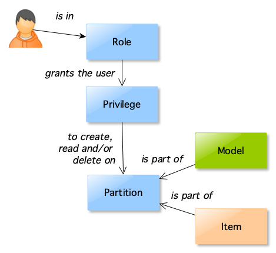
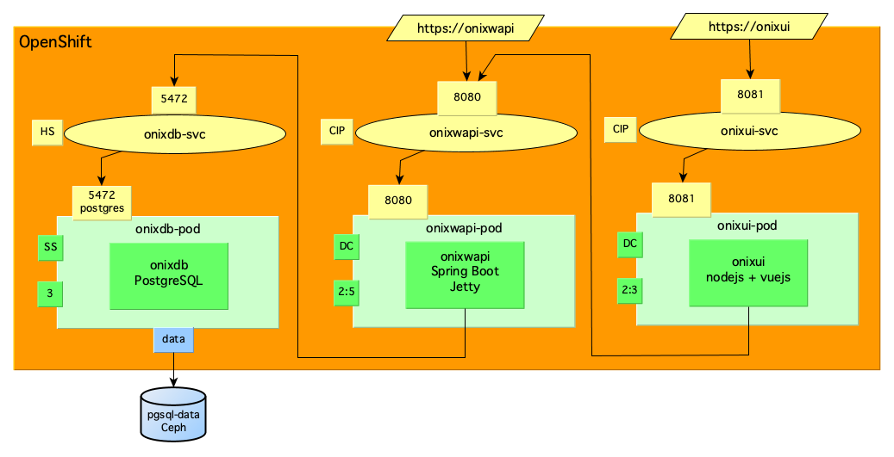
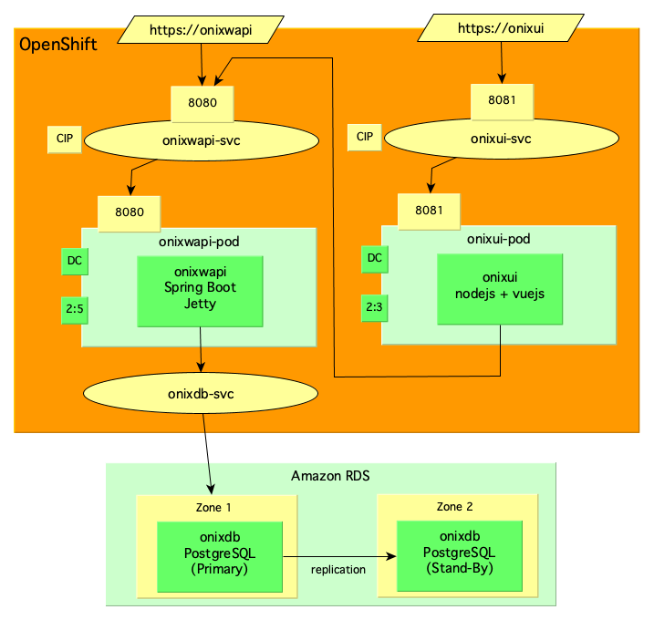
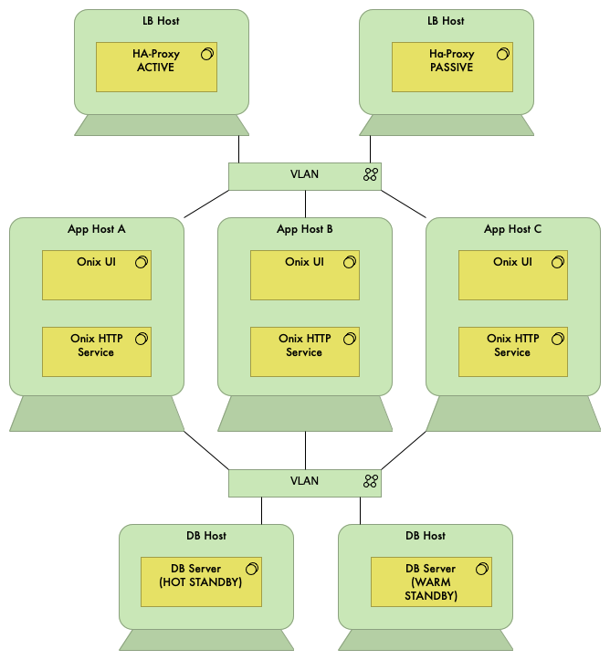

# Architecture 

This section provides an architectural overview.

### Table of Contents [(index)](./../readme.md)

- [Business View](#business-view)
- [Data View](#data-view)
  - [Semantic Model](#semantic-model)
  - [Logical Model](#logical-model)
- [Application View](#application-view)
- [Technology View](#technology-view)

## Business View

The diagram below shows high level use cases for Onix based on different personas: 

 

### Automation developer [1] [(up)](#toc)
 
Is concerned with **recording and testing configuration data changes** in a seamless way.

Developers write automation scripts and use connectors to record configuration data changes in the Onix CMDB via its Web API.
CMDB change records are tested as part of the automation development life cycle.

### Security officer [2] [(up)](#toc)
 
Is concerned with **securing access to configuration data** whilst leveraging organisation wide Identity and Access Management (IDAM) solutions.

To achieve this Onix provides [OIDC](https://openid.net/connect/) support.

### Operations team [3] [(up)](#toc)

Is concerned with **recording configuration data changes seamlessly** whilst executing automation scripts. 

As the development phase embedded and tested configuration data recording in the automation scripts, there is nothing for the Operations team to do other than execute the automation and observe changes made to the CMDB.

### End user [4] [(up)](#toc)

Is concerned with **requesting catalogue items** to be promptly deployed.

Any IT Self Service portal can provide the means to issue configuration change requests to an Automation Web API.
Configuration data changes are automatically recorded by the automation scripts.

### Data Analyst [5] [(up)](#toc)

Is concerned with **querying accurate configuration information at all times** for a variety of purposes.

As configuration data is updated when the automation scripts are executed, and has been tested as part of the development lifecycle, the information should be accurate and ready for reporting at all times.

### Development Project Members [6] [(up)](#toc)

Are concerned with **having visibility of applications and services** deployed on the infrastructure.

## Data View [(up)](#toc)

## Semantic Model 

The following figure shows the [semantic model](https://en.wikipedia.org/wiki/Semantic_data_model) for the CMDB:
 

- **Items** store configuration information and can be associated to other items using **Links**.
- **Items** are of a specified **Item Type**.
- **Links** connect **Items** creating associations.
- **Links** are of a specified **Link Type**.
- **Link Rules** apply to particular **Links** and restrict what **Item Types** the **Link** can connect.
- **Models** are collections of **Item Types** and **Link Types**.

In addition to the relations described above, role based access controls (RBAC) are also defined in the model - using partitions, privileges and roles - as described in the [RBAC section](./rbac.md#semantic-model).

## Logical Model

The following picture shows the Onix logical data model, which is comprised of three main areas:
- [Role Based Access Controls](./rbac.md): contains the entities required to partition the data model and grant privileges to selected partitions based on roles.
- [Models](../models/readme.md): define the types of items, links and link rules.
- Configuration Items: stores the configuration information based on predefined models.:

### Change Entities

Each entity in the model has a corresponding ___change entity___, which stores any change ever performed to an entity. 

Change entities also record operation executed (**I**nsert, **U**pdate, or **D**elete), the time of the change and the user/role who performed the change.

## Application View [(up)](#toc)

The following picture shows the application components and their interactions:

 

## Technology View [(up)](#toc)

#### Containerised deployment

The following picture shows the deployment for OpenShift or Kubernetes:

 

#### Containerised Web Services using Cloud Native Database services

Alternatively, a deployment with the database outside of the container platform can leverage cloud native database service features offered by public cloud providers.

For example, a deployment using [Amazon RDS in multiple availability zones](https://aws.amazon.com/rds/details/multi-az/) is shown below:

Each Availability Zone (AZ) runs on its own physically distinct, independent infrastructure, and is engineered to be highly reliable. In case of an infrastructure failure, Amazon RDS performs an automatic failover to the stand-by, so that database operations are resumed as soon as the failover is complete. Since the endpoint for the database instance remains the same after a failover, the application can resume database operation without the need for manual administrative intervention.

#### Traditional deployment

The following picture shows the deployment on traditional infrastructure:

 

