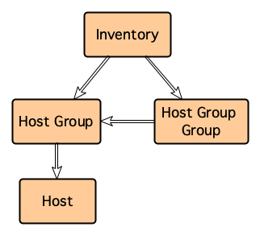

# Ansible Inventory Model 

The meta model is comprised of a set of item types, link types and link rules that represent an Ansible inventory within the CMDB. 

They are shown in the figure below:

## Item Types

| Key | Name | Description |
|---|---|---|
| ANSIBLE_HOST | Ansible Host | An host to pre provisioned by Ansible. |
| ANSIBLE_HOST_GROUP | Ansible Host Group | A group of hosts to be provisioned by Ansible. |
| ANSIBLE_HOST_GROUP_SUPER_SET | Ansible Host Group Superset| A superset of host groups to be provisioned by Ansible. |
| ANSIBLE_INVENTORY | Ansible Inventory | A collection of hosts to be provisioned by Ansible. |

## Link Types

| Key | Name | Description |
|---|---|---|
| ANSIBLE-INVENTORY | Ansible Inventory Link | Represents links connecting CIs of an Ansible Inventory. |

## Link Rules

| Key | Name | Description |
|---|---|---|
| ANSIBLE-INVENTORY->ANSIBLE-HOST-GROUP-GROUP | Ansible Inventory to Group of Host Group rule| Allows an inventory CI to connect to a group of host groups CI. |
| ANSIBLE-INVENTORY->ANSIBLE-HOST-GROUP | Ansible Inventory to Host Group rule | Allows an inventory CI to connect to a Host Group CI. |
| ANSIBLE-HOST-SUPER-SET->ANSIBLE-HOST-GROUP | Ansible Host Super Set to Host Group rule | Allows a Supe Set of Host Groups CI to connect to a Host Group CI.|
| ANSIBLE-HOST-GROUP->ANSIBLE-HOST | Ansible Host Group to Host rule | Allows a Host Group CI to connect to Host CI.|

# Importing the Meta Model

The model is encoded in a JSON file [here](ansible_model.json).

In order to import it into the CMDB, you can use the Swagger UI and import the file via the [/data PUT](http://localhost:8080/swagger-ui.html#/web-api/createOrUpdateDataUsingPUT) endpoint of the Web API.

Alternatively, a [terraform file](main.tf) is also provided as an alternative way to import the model.

([back to index](../readme.md))