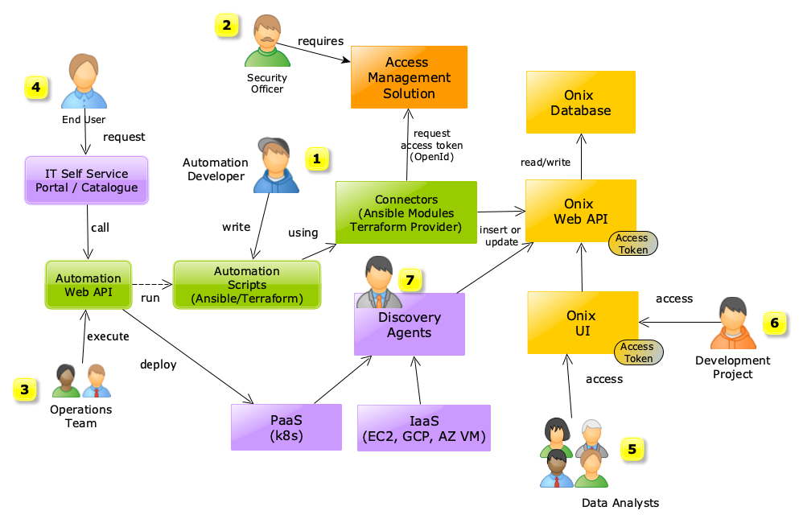

# Overview 

Onix is essentially a Spring Boot web service providing RESTful style access to a PostgreSQL database.

## Table of Contents [(index)](./../readme.md)

- [Use Case Overview](#basic-use-cases)
- [Technology Overview](#technology-overview)

## Use Case Overview

The diagram below shows high level use cases for Onix based on different personas: 

 

### Automation developer [1] [(up)](#toc)
 
Is concerned with **recording and testing configuration data changes** in a seamless way.

Developers write Ansible playbooks and use a set of [Onix Ansible Modules](./ansible.md) to record configuration data changes in the Onix CMDB.
CMDB change records are tested whilst developing the automation.

The modules handle authentication in a seamless way.

### Security officer [2] [(up)](#toc)
 
Is concerned with **securing access to configuration data** whilst leveraging organisation wide Identity and Access Management (IDAM) solutions.

To achieve this the service uses [OpenId Connect](https://openid.net) access tokens so that any compliant IDAM solution can be used to secure its [Web API](./wapi.md).

### Operations team [3] [(up)](#toc)

Is concerned with **recording configuration data changes seamlessly** whilst executing automation scripts. 

As the development phase embedded and tested configuration data recording in the Ansible playbooks, there is nothing for the Operations team to do other than execute the automation.

### End user [4] [(up)](#toc)

Is concerned with **requesting catalogue items** to be promptly deployed.

An IT Self Service portal provides the means to issue configuration changes requests to the Automation Web API.
Configuration data changes are automatically recorded by the Ansible playbooks.

### Wider organisation [5] [(up)](#toc)

Is concerned with **querying accurate configuration information at all times** for a variety of purposes.

As configuration data is updated as the automation is executed, and has been tested as part of the development lifecycle, the information should be accurate and ready for reporting at all times.

## Technology Overview

### Web API [(up)](#toc)

The [Web API](./wapi.md) is built using [Spring Boot]().
It is a stateless RESTful style web service parameterised using environment variables so it is container friendly.

The [WebAPI](./wapi.md) uses [Swagger]() for online documentation and testing of the service endpoints.

Access to the database is done using [Hibernate]().

### Database [(up)](#toc)

The [relational data model](./model.md) uses [PostgreSQL server]().

### Access Management [(up)](#toc)

The [Web API](./wapi.md) is secured using [Keycloak]().