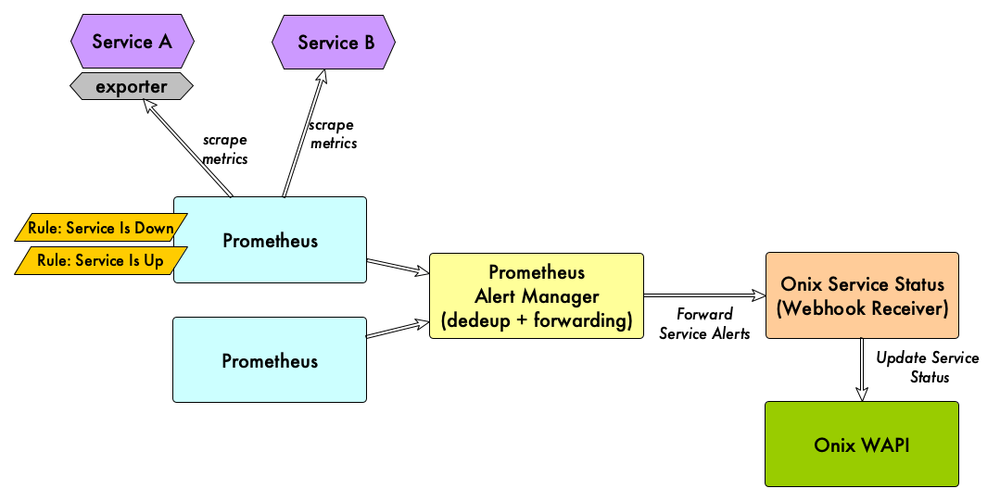
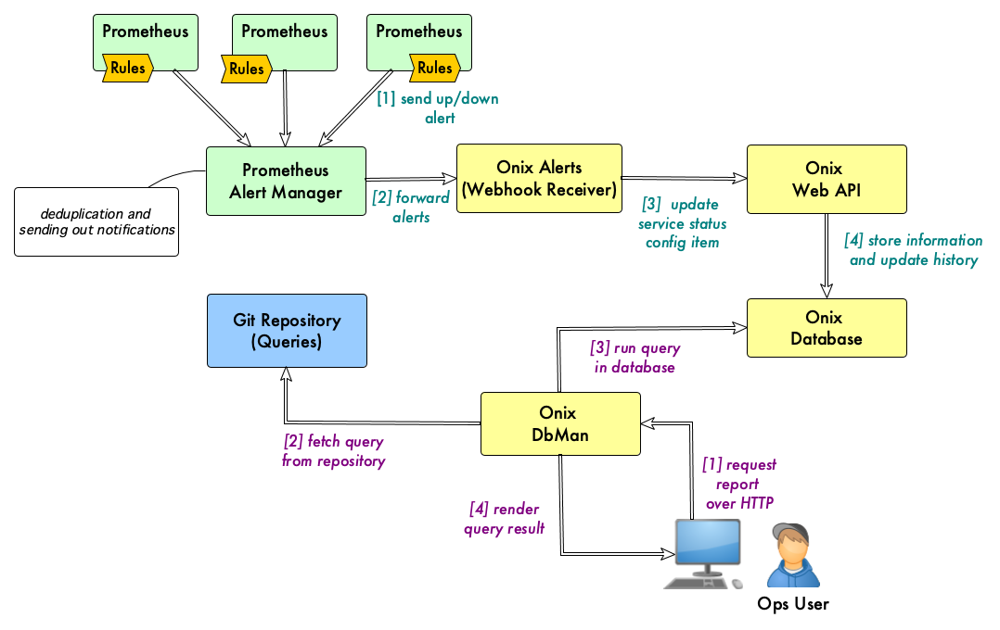

# Service Status (SeS) 

### Prometheus Webhook Receiver for Onix

Service Status (SeS) is a [Webhook Receiver](https://prometheus.io/docs/alerting/latest/configuration/#webhook_config) for Pormetheus AlertManager, that records changes in service status in Onix, thus creating a queryable audit trail history.

Prometheus can detect when services are not available when it tries and scrape metrics and fail to do so.
In this case, the **up** syntethic function can be used within a Prometheus rule.

For example, take the case of an [etcd](https://github.com/etcd-io/etcd) server cluster. Etcd exposes Prometheus metrics via an http endpoint. 

When Prometheus fails to scrape the endpoint, an "service is down" alert can be sent to the alertmanager.
The alertmanager is responsible for deduplicating alerts and forwarding them to SeS.

SeS in turn, stores the service status as configuration items in the Onix database, creating a fully auditable history of status changes which can be queried, for example, to obtain SLA information.

## Architecture

The following pictures shows how Onix Alerts integrates with the rest of the solution:

## Reporting based on Alert Information

The following figure shows how [DbMan](../../dbman/readme.md) can be used to report on alert information store in the Onix database:

