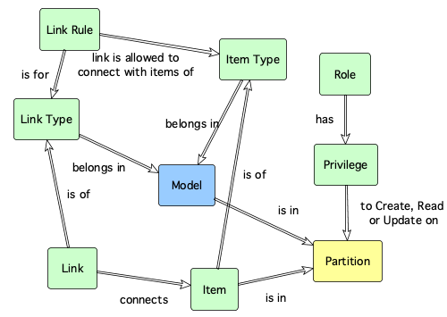

# ox_model Resource 

The ox_model resource, creates, updates or destroys a data model definition.

A data model defines a set of item types, link types and link rules that are required to store a particular configuration set.

The information in a model provides the structure to validate stored information for a particular use case.

For example, when assessing a configuration data storage requirement, a model is created to define what types of items and links are needed and how items should be linked between each other.

A data model has to be defined before items types,  link types, and configuration items can be created and linked.

## Example usage

```hcl
resource "ox_model" "AWS_EC2" {
  key         = "EC2"
  name        = "Elastic Compute Cloud Resources"
  description = "Describe the relations between Virtual Machines in AWS EC2"
  managed     = false
}
```

## Argument reference

The following arguments can be passed to a configuration item:

| Name | Use | Type |  Description |
|---|---|---|---|
| `key` | *required* | string | *The natural key that uniquely identifies the model.* |
| `name`| *required* | string | *The display name for the model.* |
| `description`| *required* | string | *A meaningful description for the model.* |
| `partition`| optional | string | *The logical access partition the model is in. If not specified, the default reference partition (REF) is used.* |
| `managed` | optional | boolean | *A flag that informs whether the model is managed by an external application process. This flag applies to all item and link types, their attributes, and link rules in the model. The default value is FALSE.* |
| `version` | optional | integer | *The version number of the model for [optimistic concurrency control](https://en.wikipedia.org/wiki/Optimistic_concurrency_control) purposes. If specified, the entity can be written provided that the specified version number matches the one in the database. If no specified, optimistic locking is disabled.* |

## Key dependencies

Before creating a model, a logical partition has to exist. Logical partitions are used to control access to the data based on roles. Where no partition is selected when creating a model, the model is automatically placed in the default reference partition - REF.



## Related resources

- Model **is in** [Partition](ox_partition.md)
- [Item Type](ox_item_type.md) **belongs in** Model
- [Link Type](ox_link_type.md) **belongs in** Model

## Web API endpoints

This resource uses the following Web API endpoint: 

```bash
/model/{model_key}
```

The table below shows what methods are mapped to what operations in the terraform resource:

| **Method** | **Operation** |
|:---:|:---:|
| PUT | Create |
| GET | Read |
| PUT | Update |
| DELETE | Delete  |