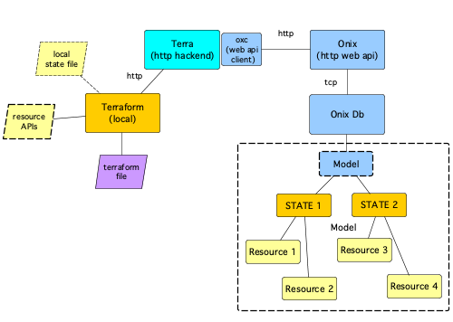

# Terra - Terraform HTTP Backend for Onix

A "backend" in Terraform stores (and retrieves) state and determines how an operation such as apply should be executed. It is an abstraction which enables non-local state storage, remote execution, etc.

By default, the normal behavior of Terraform is to use the "local" backend; which stores execution state in a file next to where the Terraform file is.

Terra is an implementation of a [Terraform HTTP Backend](https://www.terraform.io/docs/backends/types/http.html).
Terraform stores the state using a simple REST client that communicates with Terra.
State is fetched via GET, updated via POST, and purged with DELETE.

## Benefits of storing state in Onix

- When working in a team, OxTerra can protect state with locks to prevent corruption.
- All state revisions are kept in Onix history (all changes in Onix are kept in change tables).
- Sensitive information is kept off disk. Terraform retrieves state from the backend on demand and only stores in memory.
- Encryption of data at rest. State can be optionally encrypted in Onix for additional confidentiality.
- State is readily available to automation / configuration management systems using via Onix Web API.
- Single view of all Terraform resources across the infrastructure.

## Architecture

Terra exposes HTTP endpoints for Terraform to perform CRUD state operations. In addition, it connects to Onix using the [Onix Web API Client](https://github.com/gatblau/oxc).

In order to store state in Onix, Terra puts every terraform resource in a separate configuration item following the model shown in the picture below.



### Terra Repositories

Container images are available from the following snapshot and release repositories:

| Type | Repo |
|---|---|
| snapshot | docker.io/gatblau/oxterra-snapshot |
| release | docker.io/gatblau/oxterra |

### Onix Connection Configuration

The connection to the Onix Web API can be configured via variables in the Onix section of the [config.toml](config.toml) file or environment variables as follows:

| var | env | description | example |
|---|---|---|---|
| Onix.URL | OX_TERRA_ONIX_URL | The URI of the Web API | `http://localhost:8080` |
| Onix.AuthMode | OX_TERRA_ONIX_AUTHMODE | How Terra authenticates with Onix (either `none`, `basic` or `oidc`). | `basic` |
| Onix.Username | OX_TERRA_ONIX_USERNAME | The username used to authenticate with Onix if `basic` AuthMode is selected. | `admin` |
| Onix.Password | OX_TERRA_ONIX_PASSWORD | The password used to authenticate with Onix if `basic` AuthMode is selected. | `0n1x` |
| Onix.ClientId | OX_TERRA_ONIX_CLIENTID | The client identifier used to authenticate with Onix if `oidc` AuthMode is selected. | long character string |
| Onix.AppSecret | OX_TERRA_ONIX_APPSECRET | The application secret used to authenticate with Onix if `oidc` AuthMode is selected. | long character string |
| Onix.TokenURI | OX_TERRA_ONIX_TOKENURI | The url of the OpenId token server endpoint. | `https://token-server.com/oauth2/default/v1/token)` |

### Terra Settings

Terra can be configured via variables in the Service section of the [config.toml](config.toml) file or environment variables as follows:

| var | env | description | example |
|---|---|---|---|
| Service.Path | OX_TERRA_SERVICE_PATH | The root path of the service. | `state` |
| Service.Port | OX_TERRA_SERVICE_PORT | The HTTP port of the service. | `80` |
| Service.Username | OX_TERRA_SERVICE_USERNAME | The username to authe ticate with the backend. | `admin` |
| Service.Password | OX_TERRA_SERVICE_PASSWORD | The password to authenticate with the backend. | `T3rra` |
| Service.Metrics | OX_TERRA_SERVICE_METRICS | Whether the Prometheus metrics endpoint is enabled. | `true` |
| Service.InsecureSkipVerify | OX_TERRA_SERVICE_INSECURESKIPVERIFY | Whether to skip verification of TLS certificate. | `false` |

## Using Terra

To use Terra as a backend simply specify the backend section in the terraform file as follows:

```hcl-terraform
terraform {
  backend "http" {
    address = "http://terra.api.com/state/foo"
    lock_address = "http://terra.api.com/state/foo"
    unlock_address = "http://terra.api.com/state/foo"
  }
}
```

More HTTP Backend configuration information can be found in the [online documentation](https://www.terraform.io/docs/backends/types/http.html#configuration-variables).

## Launching Terra

